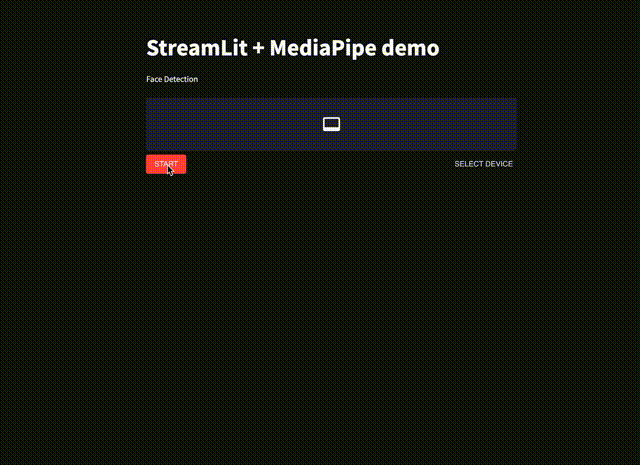

# StreamLit mediapipe-solution sample
This is a sample app that applies MediaPipe solution to a video using StreamLit.
- [MediaPipe solutions](https://google.github.io/mediapipe/solutions/solutions.html)
- [StreamLit](https://streamlit.io/)
    - [Referenced blog post](https://zenn.dev/whitphx/articles/streamlit-realtime-cv-app)

# Demo

```
$ poetry install
$ poetry run make run
```

Access to: http://localhost:8501


